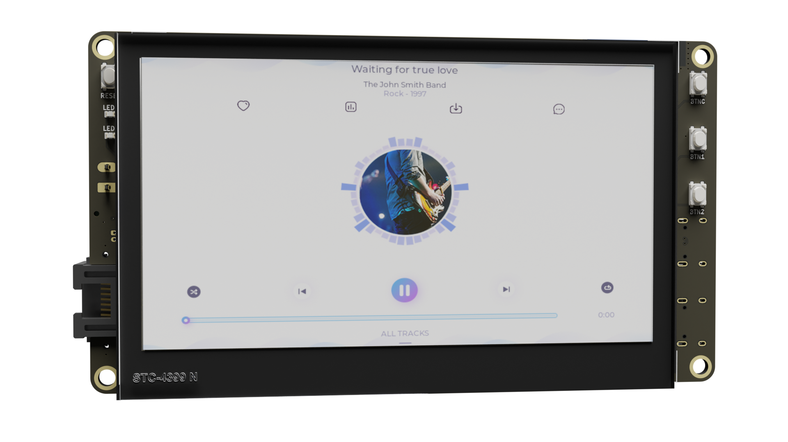
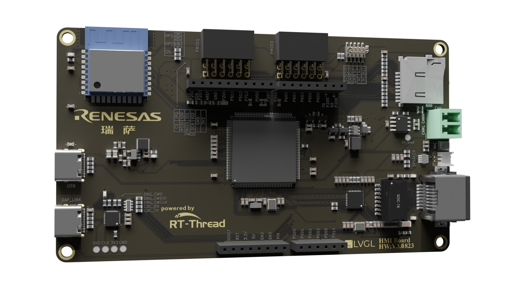
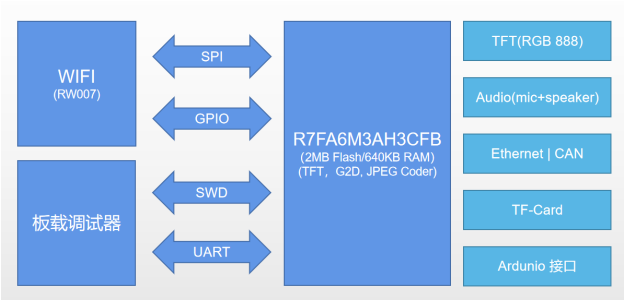

# Futuristic_Ebike 示例程序

## 简介

本专案展示LGVL 官方配套 Square Line Studio 内的范例 'Futuristic_Ebike' 移植到 RT-Thread/RA6M3-HMI-Board 的效果。并加上下列几点更新或功能
- 加上使用 RTC 实现时钟更新效果。
- 更新Renesas FSP HAL 到v4.5.0
- 致能 CAN0 Loopback test, 命令为 'can_sample'

主要内容如下：

- 开发板介绍
- BSP 快速上手指南

## 开发板介绍

基于瑞萨 RA6M3 MCU 开发的 HMI-BOARD 开发板，通过灵活配置软件包和 IDE，可帮助用户对 RA6M3 MCU 群组的特性轻松进行评估，并对嵌入系统应用程序进行开发。

开发板正面外观如下图： 



开发板背面外观如下图： 



该开发板常用 **板载资源** 如下：



- MCU：R7FA6M3AH，120MHz，Arm Cortex®-M4 内核，2MB 代码闪存, 640KB SRAM
- RA6M3(R7FA6M3AH3CFB)：Cortex-M4F 内核，120Mhz 主频，具有 2MB Flash/640KB RAM，集成 TFT 控制器、2D 加速器和 JPEG 解码器。
- 4.3 寸 LCD (RGB 888)
- 板载仿真器
- 以太网
- RW007 (SPI 高速 WIFI)
- USB-Device
- TF Crad
- CAN
- 1路麦克风，1 路扬声器
- Arduino 扩展接口
- 2 路 PMOD 扩展接口
- 4个按键：3个用户按键，一个复位按键

**更多详细资料及工具**

## 外设支持

本 BSP 目前对外设的支持情况如下：

| **片上外设** | **支持情况** | **备注**                 |
| :----------: | :----------: | :----------------------- |
|     UART     |     支持     | UART9 为默认日志输出端口 |
|     GPIO     |     支持     |                          |
|     LCD      |     支持     |                          |
|     SDHI     |     支持     |                          |
|     JPEG     |     支持     |                          |
|     G2D      |     支持     |                          |
|    RW007     |     支持     |                          |
|     ETH      |     支持     |                          |
|     SPI      |     支持     |                          |
|     I2C      |     支持     |                          |
|     CAN      |     支持     |                          |
|     RTC      |     支持     |                          |

* 注意：仓库刚拉下来是最小系统，若需添加/使能其他外设需参考：[外设驱动使用教程 (rt-thread.org)](https://www.rt-thread.org/document/site/#/rt-thread-version/rt-thread-standard/tutorial/make-bsp/renesas-ra/RA系列BSP外设驱动使用教程)

## 使用说明

使用说明分为如下两个章节：

- 快速上手

  本章节是为刚接触 RT-Thread 的新手准备的使用说明，遵循简单的步骤即可将 RT-Thread 操作系统运行在该开发板上，看到实验效果 。
- 进阶使用

  本章节是为需要在 RT-Thread 操作系统上使用更多开发板资源的开发者准备的。通过使用 ENV 工具对 BSP 进行配置，可以开启更多板载资源，实现更多高级功能。

### 快速上手

- 本 SDK 可以从 studio 的 SDK 管理界面直接下载，并基于本 SDK 新建工程。
- 本 SDK 同时提供 MDK5 工程。下面以 MDK5 开发环境为例，介绍如何将系统运行起来。

**编译下载**

- 首先双击 mklinks.bat ，然后打开 env 执行 `scons --target=mdk5` 生成新的 mdk5 工程

  >  **注意**：若电脑没管理员权限点击不了mklinks.bat，则需要手动将 sdk-bsp-ra6m3-hmi-board1目录下的 rt-thread 和 libraries 文件夹拷贝到当前工程目录下

- 编译：双击 project.uvprojx 文件，打开 MDK5 工程，编译程序。（注意 AC6 版本可选 6.14、6.16、6.19，勿选择 6.15 版本编译）

- 下载：点击 MDK 的 download/Debug 按钮进行下载调试

**查看运行结果**

下载程序成功之后，系统会自动运行并打印系统信息。

连接开发板对应串口到 PC , 在终端工具里打开相应的串口（115200-8-1-N），复位设备后，可以看到 RT-Thread 的输出信息。输入 help 命令可查看系统中支持的命令。

```bash
 \ | /
- RT -     Thread Operating System
 / | \     5.0.1 build Aug 29 2023 11:44:43
 2006 - 2022 Copyright by RT-Thread team
lwIP-2.0.3 initialized!
Hello RT-Thread!
msh >
msh >help
help             - RT-Thread shell help.
ps               - List threads in the system.
free             - Show the memory usage in the system.
clear            - clear the terminal screen
version          - show RT-Thread version information
list             - list objects

msh > 
```

**应用入口函数**

应用层的入口函数在  **sdk-bsp-ra6m3-hmi-board\projects\hmi-board-lvgl\src\hal_entry.c**  中 的 `void hal_entry(void)` 。用户编写的源文件可直接放在 src 目录下。

```c
void hal_entry(void)
{
    rt_kprintf("\nHello RT-Thread!\n");

    while (1)
    {
        rt_pin_write(LED3_PIN, PIN_HIGH);
        rt_thread_mdelay(500);
        rt_pin_write(LED3_PIN, PIN_LOW);
        rt_thread_mdelay(500);
    }
}
```

## 联系人信息

在使用过程中若您有任何的想法和建议，建议您通过以下方式来联系到我们  [RT-Thread 社区论坛](https://club.rt-thread.org/)

## SDK 仓库

这是 HMI-Board 的 SDK 仓库地址：[sdk-bsp-ra6m3-hmi-board](https://github.com/RT-Thread-Studio/sdk-bsp-ra6m3-hmi-board)，该仓库包括了外设驱动以及丰富的示例工程，如果像体验官网/社区提供的开源示例请转移到该仓库进行开发。RT-Thread 主仓库只维护最新的驱动相关代码。

## 贡献代码

如果您对  RA6M3-HMI-Board 感兴趣，并且有一些好玩的项目愿意与大家分享的话欢迎给我们贡献代码，您可以参考 [如何向 RT-Thread 代码贡献](https://www.rt-thread.org/document/site/#/rt-thread-version/rt-thread-standard/development-guide/github/github)。